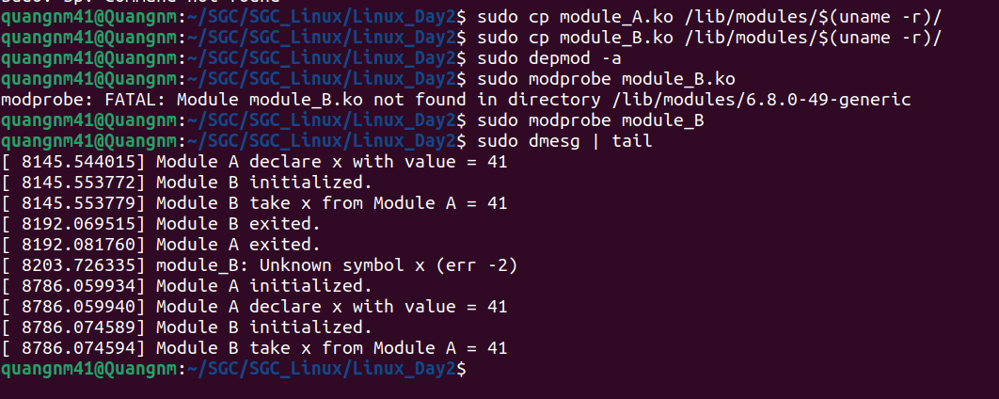

# Linux Day 2 #

## Make kernel module ##
### Licensing and Module Documentation ###
- Loadable kernel modules also require a `MODULE_LICENSE()` tag.
    ```bash
    /*
    * The following license idents are currently accepted as indicating free
    * software modules
    *
    *	"GPL"				[GNU Public License v2 or later]
    *	"GPL v2"			[GNU Public License v2]
    *	"GPL and additional rights"	[GNU Public License v2 rights and more]
    *	"Dual BSD/GPL"			[GNU Public License v2
    *					 or BSD license choice]
    *	"Dual MIT/GPL"			[GNU Public License v2
    *					 or MIT license choice]
    *	"Dual MPL/GPL"			[GNU Public License v2
    *					 or Mozilla license choice]
    */
    ```
- `MODULE_DESCRIPTION()` is used to describe what the module does.
- `MODULE_AUTHOR()` declares the module's author
- Example:
    ```bash
    MODULE_LICENSE("GPL");
    MODULE_AUTHOR("QuangNM41");
    MODULE_DESCRIPTION("Test module A");
    ```
### Passing Command Line Arguments to a Module ###
- Use the `module_param()` macro, (defined in `linux/moduleparam.h`)
- The `module_param()` macro takes 3 arguments: the name of the variable, its type and permissions for the corresponding file in sysfs.
    ```bash
    module_param(x, int, S_IRUSR | S_IWUSR | S_IRGRP | S_IROTH);
    ```
### Make kernel ###
- Kernel modules must have at least two functions: 
    1. A "start" (initialization) function called `init_module()` which is called when the module is `insmoded` into the kernel.
    2. An "end" (cleanup) function called `cleanup_module()` which is called just before it is `rmmoded`.
- Every kernel module needs to include `linux/module.h`.
- `printk()` happens to be a logging mechanism for the kernel, and is used to log information or give warnings.
- Needed to include `linux/kernel.h` only for the macro expansion for the `printk()`
- Macros `module_init()` and `module_exit()` allow renaming the init and cleanup functions of kernel modules.
- The `__init` and `__exit` macros are used to specify module initialization and exit functions. 
- These macros are defined in `linux/init.h` and serve to free up kernel memory.
- Use `EXPORT_SYMBOL()` while the other module will just call the functions and use the exported variables. Other modules that want to use it need the `extern` keyword
    ```bash
    //module_A
    int x = 41;
    EXPORT_SYMBOL(x);

    //module_B
    extern int x;
    ```

    ```bash
    static int __init moduleA_init(void)
    {
        printk(KERN_INFO "Module A initialized.\n");
        printk(KERN_INFO "Module A declare x with value = %d\n", x);
        return 0;
    }

    static void __exit moduleA_exit(void)
    {
        printk(KERN_INFO "Module A exited.\n");
    }

    MODULE_LICENSE("GPL");
    MODULE_AUTHOR("QuangNM41");
    MODULE_DESCRIPTION("Test module A");

    module_init(moduleA_init);
    module_exit(moduleA_exit);
    ```

## Makefile ##
- Kernel modules need to be compiled a bit differently from regular userspace apps.
- Former kernel versions required us to care much about these settings, which are usually stored in `Makefiles`.
- Makefile for a basic kernel module:
    ```bash
    obj-m += hello.o

    all:
        make -C /lib/modules/$(shell uname -r)/build M=$(PWD) modules

    clean:
        make -C /lib/modules/$(shell uname -r)/build M=$(PWD) clean
    ```
- Compile the module by issuing the command `make`
- After compile successful, the system will generate `.ko` file, it is kernel object file. 

## Upload kernel module ##
- All the messages received from the kernel ring buffer is displayed when we execute the command `dmesg`, here only the latest messages will be shown.
    ```bash
    sudo dmesg
    ```
### Upload kernel by manual method ###
- `insmod` command in Linux systems is used to insert modules into the kernel.
    ```bash
    insmod [file name] [module-options...]
    ```
- The `rmmod` command in Linux is used to remove or unload a module from the kernel.
    ```bash
    rmmod [options] [modulename]
    ```
### Upload kernel automatic method by `depmod` ###

    ```
