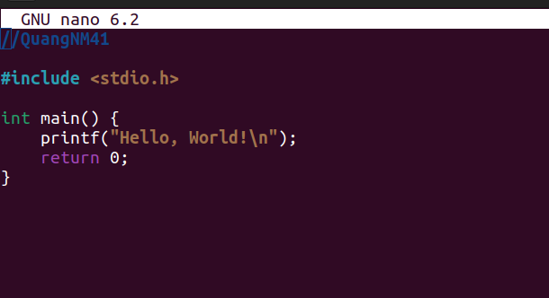
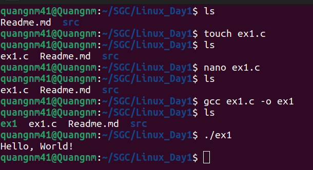
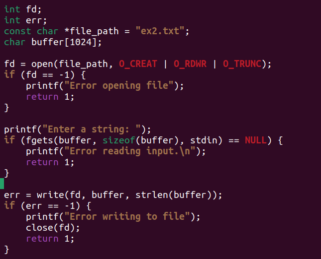
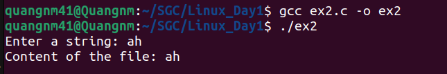
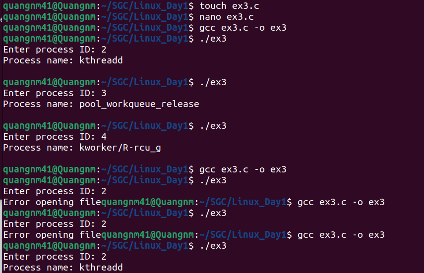
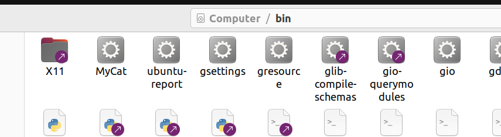
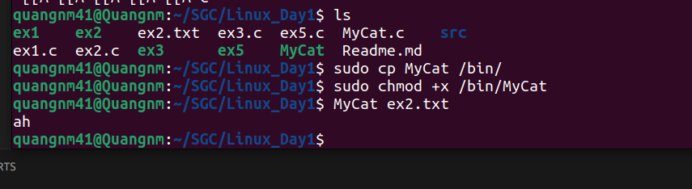
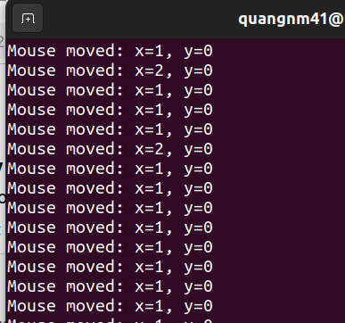

# Linux Day 1 #

## Task 1:
Write a simple "Hello World" program in C, compile it using `gcc`, and run the program from the console.

### Steps:

#### 1. Create a new C file:
  - Open a terminal and navigate to main project directory.
  - Create a new file called `ex1.c`:
    ```bash
    touch ex1.c
    ```
  - Open the file in the `nano` text editor:
    ```bash
    nano ex1.c
    ```

#### 2. Write the program:
  - In the `nano` editor, write the C code.
  - Save the file by pressing `Ctrl + O` and then hit `Enter` to confirm.
  - Exit the editor by pressing `Ctrl + X`.
  
#### 3. Compile the Program with `gcc`:
  - Compile your C program using the `gcc` compiler:
    ```bash
    gcc ex1.c -o ex1
    ```
  - This will create an executable file named `ex1`.

#### 4. Run the Program:
  - Run the compiled program using the following command:
    ```bash
    ./ex1
    ```

#### Expected Output:
`Hello, World!`


---

## Task 2:
Write a program to print the contents of a text file to the console, with the file path set within the code. 

### Steps:
#### 1. Create a new C file:
  - Open a terminal and navigate to main project directory.
  - Create a new file called `ex2.c`:
    ```bash
    touch ex2.c
    ```
  - Open the file in the `nano` text editor:
    ```bash
    nano ex2.c
    ```

#### 2. Write the program:
  - In the `nano` editor, write the C code.
    - Using `open()` with flags:
    1. `O_CREAT`: If pathname does not exist, create it as a regular file.
    2. `O_RDWR`: Read and write permissions.
    3. `O_TRUNC`: If the file already exists and is a regular file and the access mode allows writing it will be truncated to length 0. 
    
    - `write()`: the number of bytes written is returned.
    - `read()` : the number of bytes read is returned.
    - `lseek()`: repositions the file offset of the open file.
    - `close()`: closes a file descriptor.
  - Save the file by pressing `Ctrl + O` and then hit `Enter` to confirm.
  - Exit the editor by pressing `Ctrl + X`.

#### 3. Compile the Program with `gcc`:
  - Compile your C program using the `gcc` compiler:
    ```bash
    gcc ex2.c -o ex2
    ```
  - This will create an executable file named `ex2`.

#### 4. Run the Program:
  - Run the compiled program using the following command:
    ```bash
    ./ex2
    ```

#### Expected Output:

---

## Task 3:
Write a program that prints the name of the process from the process ID entered from the keyboard. 

### Steps:
#### 1. Create a new C file:
  - Open a terminal and navigate to main project directory.
  - Create a new file called `ex3.c`:
    ```bash
    touch ex3.c
    ```
  - Open the file in the `nano` text editor:
    ```bash
    nano ex3.c
    ```
#### 2. Write the program:
  - In the `nano` editor, write the C code.
  - The running process also is stored in /proc folder with process ID. Each process is stored in the proc folder into a folder with the main name process ID. To take name of process, we can access to file comm in its.
  - Save the file by pressing `Ctrl + O` and then hit `Enter` to confirm.
  - Exit the editor by pressing `Ctrl + X`.
#### 3. Compile the Program with `gcc`:
  - Compile your C program using the `gcc` compiler:
    ```bash
    gcc ex3.c -o ex3
    ```
  - This will create an executable file named `ex3`.
#### Expected Output:

---

## Task 4:
Write a program that can display the contents of a file to the console, similar to the cat command. Name it MyCat and copy it to the /bin directory. Then use it like the system's cat command. 

### Steps:
#### 1. Create a new C file:
  - Open a terminal and navigate to main project directory.
  - Create a new file called `ex4.c`:
    ```bash
    touch MyCat.c
    ```
  - Open the file in the `nano` text editor:
    ```bash
    nano MyCat.c
    ```
#### 2. Write the program:
  - In the `nano` editor, write the C code.
  - Using main function with arguments to handle path of file.
  For example, when the program is called as follows: 
  `MyCat ex2.txt`, then:
    - argv[0] is `MyCat`
    - argv[1] is `ex2.txt`
  ```c
  int main(int argc, char *argv[]) {
    if (argc != 2) {
        printf("Error arguments\n");
        return 1;
    }

    const char *filename = argv[1];
    int fd = open(filename, O_RDONLY);
    if (fd == -1) {
        printf("Error opening file");
        return 1;
    }
  }
  ```
  - Save the file by pressing `Ctrl + O` and then hit `Enter` to confirm.
  - Exit the editor by pressing `Ctrl + X`.
#### 3. Compile the Program with `gcc`:
  - Compile your C program using the `gcc` compiler:
    ```bash
    gcc MyCat.c -o MyCat
    ```
  - This will create an executable file named `MyCat`.
  - Using `cp` to copy executable file to `/bin`
  ```bash
    sudo cp MyCat /bin/
  ```
  
  - Set executable permissions by `chmod +x`
  ```bash
  sudo chmod +x /bin/MyCat
  ```
#### Expected Output:

---

## Task 5:
Write a program that prints the name of the process from the process ID entered from the keyboard. 

### Steps:
#### 1. Create a new C file:
  - Open a terminal and navigate to main project directory.
  - Create a new file called `ex5.c`:
    ```bash
    touch ex5.c
    ```
  - Open the file in the `nano` text editor:
    ```bash
    nano ex5.c
    ```
#### 2. Write the program:
  - In the `nano` editor, write the C code.
  - `/dev/input/mice` is a file for all connected mice, receiving all mouse events (movements and button presses).
  - Mouse data:
    - The data each time the mouse moves will be in 3 bytes:
        1. First byte (data[0]): Mouse button code (including left, right, center, scroll).
        2. Second byte (data[1]): Mouse movement along the x axis.
        3. Third byte (data[2]): Mouse movement along the y axis.
  - Save the file by pressing `Ctrl + O` and then hit `Enter` to confirm.
  - Exit the editor by pressing `Ctrl + X`.
#### 3. Compile the Program with `gcc`:
  - Compile your C program using the `gcc` compiler:
    ```bash
    gcc ex5.c -o ex5
    ```
  - This will create an executable file named `ex5`.
  - Run `ex5` with `sudo`
#### Expected Output:

---